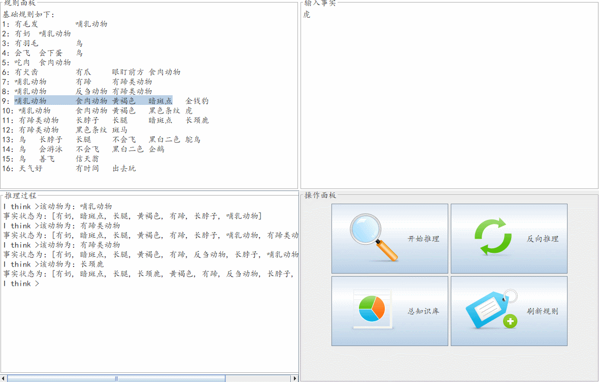

# Java动物识别专家系统

数据库连接，界面友好，方便规则增删改查。

### 欢迎界面


左上面板为当前规则面板，显示了当前知识库中的规则。方便复制粘贴。右侧为输入面板，可以输入已知结论或待推理事实。

左下为欢迎界面，打印出"Java Expert"样式。下方`I think>`借鉴了常见的命令提示符的设计，提示用户输入。

右下为4个简单的按钮，分别是开始推理、反向推理、查看知识库、与刷新规则库。

### 正向推理

输入待推理结论，点击开始推理即可在右侧查看推理过程与结论。



### 反向推理

输入欲推证结论，系统开始询问，并尝试与已知规则进行匹配。


### 查看数据库

点击查看数据库，即可查看到数据库的当前状态，并可以对其进行增删改查。


### 推理新的规则


对刚刚添加进数据库的规则进行新的推理。同样还可以反向推理，可以试试哦。


## 如何安装运行

本项目开发环境为jdk1.8+Mysql8.0，可以IDEA集成开发环境。

1. 克隆本项目
```
git clone https://github.com/RonDen/JavaAnimalExpertSystem.git
```

2. 修改数据库连接，`RuleDao.java`文件：

```java
String url = "jdbc:mysql://localhost:3306/animalsys?useUnicode=true&characterEncoding=UTF-8&serverTimezone=UTC";
String username = "root";
String password = "password";
```

修改为你的数据库用户名及密码即可。

3. 添加规则

进入mysql控制台，导入`resource/animalsys.sql`文件中的规则即可插入规则，完成初始化。

```
mysql> use animalsys;
mysql> source animalsys.sql;
```

Just Have Your Fun!